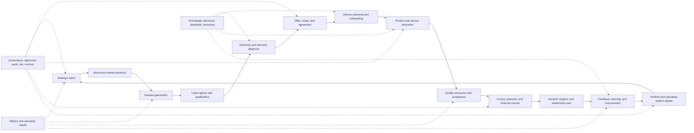

# CompanyCore Global Business Flow

Last updated: 2026-05-16

## Purpose

This document defines the global company value-flow model for CompanyCore. It
connects brand, demand generation, sales, discovery, product/service delivery,
payment, post-delivery feedback, improvement, and governance into one
visualizable operating pipeline.

It complements:

- `docs/architecture/system-architecture.md`
- `docs/architecture/organizational-architecture-bridge.md`
- `docs/architecture/companycore-business-module-map.md`
- `docs/architecture/department-management-systems-architecture.md`

This is an architecture and product operating model. It does not approve broad
schema, UI, API, MCP, automation, or provider work by itself. Future
implementation must still use scoped task contracts, existing Company OS
tables, command-shaped writes, permission gates, audit evidence, and module
confidence updates.

## Model Basis

The global flow combines three stable lenses:

| Lens | What it contributes | CompanyCore interpretation |
| --- | --- | --- |
| Value chain | How a company creates, sells, delivers, supports, and improves value. | One end-to-end business pipeline from market signal to learning loop. |
| Service blueprint | How customer-facing moments connect to backstage work, systems, and evidence. | Every stage separates customer outcome, internal process, owner/agent action, provider/tool use, and proof. |
| Operating graph | How goals, roles, processes, tasks, resources, knowledge, metrics, risks, decisions, and audit relate. | The pipeline is a graph view over existing CompanyCore modules, not a separate source of truth. |

CompanyCore should therefore represent the business as:

```text
intent -> market -> lead -> opportunity -> discovery -> offer
  -> delivery plan -> product/service work -> acceptance -> payment
  -> support -> feedback -> improvement -> next intent
```

## Global Pipeline

The canonical global flow is:

```text
1. Strategic intent
2. Brand and market presence
3. Demand generation
4. Lead capture and qualification
5. Discovery and advisory diagnosis
6. Offer, scope, and agreement
7. Delivery planning and onboarding
8. Product and service execution
9. Quality assurance and acceptance
10. Invoice, payment, and financial closure
11. Handoff, support, and relationship care
12. Feedback, learning, and improvement
13. Portfolio and operating-system update
```

The flow is cyclic. Stage 13 updates the next strategic intent, improves the
offer, updates processes, adjusts marketing/sales signals, and produces new
tasks, standards, knowledge, controls, metrics, and training material.

## One-Page Executive View



## Dependency Tree

This tree is the display model for strategic presentations, planning screens,
and future graph views.

```text
Company value system
+-- Direction
|   +-- Strategic intent
|   +-- Goals and targets
|   +-- Metrics and success criteria
|   +-- Decisions and risk posture
+-- Market engine
|   +-- Brand positioning
|   +-- Marketing content and campaigns
|   +-- Channels and advertising
|   +-- Lead sources
|   +-- Audience signals and research
+-- Commercial engine
|   +-- CRM relationships
|   +-- Lead qualification
|   +-- Discovery calls and notes
|   +-- Proposals, scope, and pricing
|   +-- Agreements and approvals
|   +-- Deal pipeline
+-- Delivery engine
|   +-- Client onboarding
|   +-- Product backlog or service plan
|   +-- Project and task execution
|   +-- Processes, pipelines, stages, procedures
|   +-- Quality checks and acceptance criteria
|   +-- Artifacts, files, releases, and handoff
+-- Revenue engine
|   +-- Invoice trigger
|   +-- Payment status
|   +-- Receivables follow-up
|   +-- Cost and margin signals
|   +-- Financial closure
+-- Relationship and support engine
|   +-- Delivery summary
|   +-- Support requests
|   +-- Success check-ins
|   +-- Renewal or expansion opportunities
|   +-- Testimonials and referrals
+-- Learning engine
|   +-- Post-delivery survey
|   +-- Internal retro
|   +-- Process improvements
|   +-- Knowledge updates
|   +-- Standards updates
|   +-- New tasks, risks, controls, and decisions
+-- Operating foundation
    +-- Roles and responsibilities
    +-- Resources and tools
    +-- Integrations and provider adapters
    +-- AI agents and MCP tools
    +-- Policies, approvals, audit logs, and events
    +-- System health and module confidence
```

## Stage Contract

Each stage should be represented as a process or pipeline stage only when the
business needs operational execution, measurement, automation, or evidence. Do
not create duplicate per-stage modules when existing CompanyCore modules own
the underlying data.

| Stage | Owner-facing question | Core output | Primary modules | Typical evidence |
| --- | --- | --- | --- | --- |
| 1. Strategic intent | What are we trying to build, sell, and improve now? | Goals, targets, priorities, constraints | Strategy, Goals, Metrics, Decisions | goal, target, decision log, metric |
| 2. Brand and market presence | Why should the market trust us? | Positioning, proof points, content themes | Knowledge, Resources, Marketing/Growth area | content asset, resource, KPI |
| 3. Demand generation | Where do qualified opportunities come from? | Campaigns, channels, lead source signals | CRM, Metrics, Integrations | campaign record, lead source, metric |
| 4. Lead capture and qualification | Who is worth pursuing now? | Qualified lead or rejected lead | CRM, Relationships, Tasks | client/stakeholder, interaction, task |
| 5. Discovery and advisory diagnosis | What problem should we solve and why? | Discovery notes, needs, risks, success criteria | CRM, Knowledge, Decisions, Risks | notes, decision, risk, transcript/source |
| 6. Offer, scope, and agreement | What exactly are we promising and under which terms? | Scope, proposal, pricing, approval, agreement | CRM, Governance, Resources, Finance | deal, approval, document, audit |
| 7. Delivery planning and onboarding | How will value move from input to outcome? | Delivery plan, pipeline run, tasks, responsibilities | Processes, Pipelines, Tasks, Roles | pipeline run, stage run, task list |
| 8. Product and service execution | What work is being done and what is blocked? | Product increment, service artifact, operational work | Tasks, Runtime Evidence, Storage, Agents | task, artifact, event, audit |
| 9. Quality assurance and acceptance | Does the output meet the promise? | Acceptance decision and evidence | Acceptance Criteria, Audit, Metrics | test result, acceptance criterion, approval |
| 10. Invoice, payment, and financial closure | Has the company captured the value it delivered? | Invoice/payment status and margin signal | Finance, CRM, Metrics, Resources | invoice resource, payment status, metric |
| 11. Handoff, support, and relationship care | Can the client succeed after delivery? | Handoff package, support path, relationship plan | Knowledge, CRM, Tasks, Resources | document, support task, interaction |
| 12. Feedback, learning, and improvement | What should change next time? | Survey, retro, improvement tasks | Feedback, Knowledge, Processes, Decisions | survey result, retro note, task, standard update |
| 13. Portfolio and operating-system update | What changes in the company system? | Updated offer, process, standard, KPI, or backlog | Company Graph, Governance, Metrics, Module Confidence | decision log, policy/control, requirement, ledger row |

## Product And Service Delivery Rule

CompanyCore must support both products and services without splitting the
company into two unrelated operating models.

| Delivery type | What changes | What stays shared |
| --- | --- | --- |
| Product | Delivery may involve backlog, release, QA, deployment, support, versioning, and roadmap. | Discovery, agreement, planning, tasks, acceptance, payment, feedback, metrics, audit. |
| Service | Delivery may involve diagnosis, consultation, implementation, training, documentation, and client enablement. | Discovery, agreement, planning, tasks, acceptance, payment, feedback, metrics, audit. |
| Hybrid product + service | Delivery combines product artifact plus implementation/advisory work. | One client journey, one scope, one evidence chain, one feedback loop. |

The shared runtime shape is:

```text
Client/Stakeholder -> Deal/Opportunity -> Discovery -> Agreement
  -> PipelineRun -> StageRuns -> Tasks/Artifacts -> Acceptance
  -> Invoice/Payment -> Feedback -> Improvement Tasks
```

## Relationship Model

The global pipeline should be rendered as relationships between existing
CompanyCore concepts:

| Relationship | Meaning |
| --- | --- |
| Goal -> Marketing signal | Strategy creates the message and target market for demand generation. |
| Marketing signal -> Lead | A campaign, content asset, referral, or channel produces a potential client. |
| Lead -> Client/Stakeholder | Qualification turns a lead into a relationship record or rejects it. |
| Client -> Interaction -> Discovery note | Discovery evidence explains the real problem and decision context. |
| Discovery -> Offer/Deal | Diagnosis becomes scope, price, risk, and agreement. |
| Deal -> PipelineRun | Accepted commercial work starts a delivery execution path. |
| PipelineRun -> StageRun -> Task | Delivery stages produce executable work and handoffs. |
| Task -> Artifact/Resource | Work produces files, documents, code, deliverables, or operational assets. |
| Artifact -> AcceptanceCriterion | Deliverables are checked against the promise. |
| Acceptance -> Invoice/Payment | Value delivery triggers revenue capture. |
| Payment -> Support/Handoff | Financial closure moves the relationship into success/support mode. |
| Feedback -> Decision/Standard/Process/Task | Learning updates the operating system and creates the next improvement. |

## Operating Area Mapping

The 13 approved operating areas remain the owner-facing map. The global
pipeline cuts across them:

| Pipeline zone | Primary operating areas | Supporting areas |
| --- | --- | --- |
| Direction | 01 Strategy and governance | 12 AI agents and observability, 09 Knowledge and decisions |
| Market engine | 05 Marketing and growth | 04 Sales and CRM, 10 Assets and storage |
| Commercial engine | 04 Sales and CRM | 01 Strategy, 06 Finance and billing, 09 Knowledge |
| Delivery engine | 02 Projects and delivery, 03 Tasks and workflow | 08 Operations, 10 Assets, 12 AI agents |
| Revenue engine | 06 Finance and billing | 04 Sales and CRM, 08 Operations |
| Relationship and support | 04 Sales and CRM, 08 Operations | 09 Knowledge, 02 Projects |
| Learning engine | 09 Knowledge and decisions, 01 Strategy and governance | all areas through improvement tasks |
| Operating foundation | 00 Glowny, 11 Automations and integrations, 12 AI agents and observability | all areas |

Area labels in user-facing UI may use the current LuckySparrow Polish names,
but repository architecture artifacts should preserve English source-of-truth
language.

Each area should be implemented as a department management system in V1. The
department system owns the vertical management view for its part of the
horizontal flow, while the global flow remains the cross-department value
journey.

## Visualization Levels

The same model should be shown at different depths depending on the audience:

| Level | Audience | View |
| --- | --- | --- |
| L0 Executive loop | Owner, leadership, investor-style presentation | 13-stage pipeline with feedback loop and health signals. |
| L1 Department handoff map | Directors, managers, agents | Pipeline stages mapped to operating areas, roles, responsibilities, and active bottlenecks. |
| L2 Process graph | Operators, builders, supervised agents | Processes, pipelines, stages, tasks, resources, approvals, and evidence. |
| L3 Execution trace | QA, ops, auditors, AI supervisors | PipelineRun, StageRun, acceptance criteria, events, audit logs, metrics, and decisions. |

Future UI should avoid showing every relationship at once. It should let the
operator move from L0 to L3 progressively.

## AI And Automation Boundary

Agents may help analyze gaps, propose work, create tasks, draft documents, and
report status only through CompanyCore API/MCP boundaries.

The global pipeline does not permit agents to:

- bypass workspace ownership;
- write directly to PostgreSQL;
- use raw provider tokens;
- mutate active workflows through raw CRUD;
- skip approval gates for risky actions;
- mark delivery accepted without acceptance evidence;
- close feedback loops without recording what changed.

AI-facing stages should be exposed through layers:

```text
Intent -> Knowledge -> Planning -> Tools -> Access -> Audit -> Feedback
```

This keeps Paperclip, Jarvis, Codex, n8n, and future agents aligned with the
same company value flow used by humans.

## Metrics And Health

Each stage should eventually have health signals:

| Stage group | Example signals |
| --- | --- |
| Direction | active goals, stale decisions, priority conflicts, risk posture |
| Market | lead source quality, campaign activity, brand/content freshness |
| Commercial | qualified leads, discovery completion, proposal win rate, blocked deals |
| Delivery | active pipeline runs, blocked stages, overdue tasks, acceptance pass rate |
| Revenue | invoice readiness, payment status, margin, receivables aging |
| Support | open support tasks, handoff completeness, client satisfaction |
| Learning | feedback collected, retro completion, process changes shipped |
| Foundation | integration health, MCP safety, audit completeness, module confidence |

Metrics must be connected to owners, goals, and evidence. Do not add vanity
metrics that cannot trigger a decision, task, risk, or improvement.

## Implementation Guardrails

- Reuse the existing CompanyCore business modules before adding new modules.
- Prefer derived read models and graph projections before new write models.
- Keep high-impact writes command-shaped, approval-aware, and audited.
- Treat payment, pricing, legal, and client commitment changes as high-risk
  until explicit finance/legal contracts exist.
- Treat post-delivery feedback as a source of requirements, risks, standards,
  and improvement tasks, not as an isolated survey table.
- Do not create a generic edge table only to make the graph look complete.
  Add durable relations only when a concrete workflow proves the need.
- Do not split product delivery and service delivery into separate company
  operating systems; use one journey with type-specific delivery stages.

## Future Work Candidates

1. Add a global business-flow read model that projects the existing operating
   graph into the 13-stage pipeline.
2. Add a Company Atlas executive view that renders L0/L1 flow health without
   adding new source-of-truth state.
3. Add scoped finance/billing requirements before invoice/payment runtime work.
4. Add post-delivery feedback requirements and survey-to-improvement task flow.
5. Add CRM opportunity/discovery/offer relation proof before broad sales
   automation.
6. Expose a read-only MCP tool for agents to inspect the global business flow
   once the read model exists.
