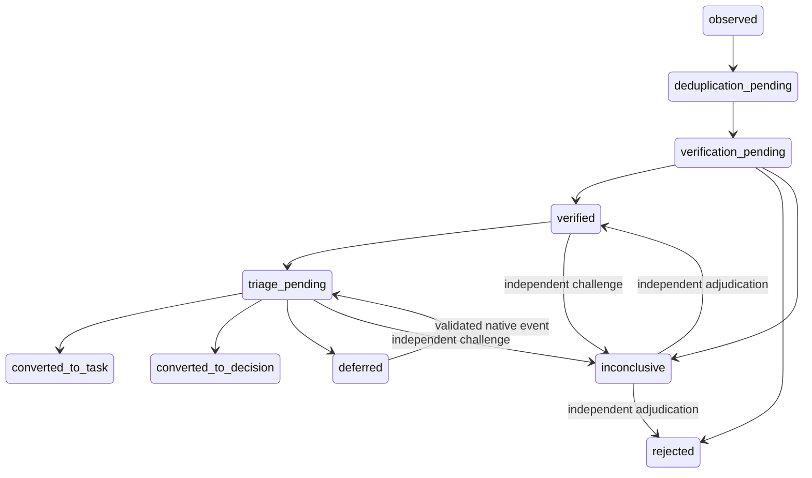

# Governed findings and triage

RF-CTX-021 extends `CapabilityObservation` in Product Engineering. It does not
create a second issue tracker or change a capability's observed/target state.
The application's existing Evidence view owns the workbench. Execution, risk,
procedure composition, Decisions, interviews and attention retain their native
owners.

## Identity, evidence and versions

A Finding has one observation identity and immutable numbered `finding_versions`.
Each version records classification (`defect`, `unfinished_function`,
`stale_documentation`, `missing_assumption`, `improvement`), application/component,
scope/exclusions, source references, observed/expected behavior, reproducibility,
environment/build and source revisions, impact, known risk, competencies and
decision need. Sources and evidence reference existing records in the same
workspace and application; a company-wide company record is allowed explicitly.
An application-scoped source task is required before protected verification and
triage. An observation may be recorded without it and remains blocked.

The server derives the typed author from the authenticated human membership or
bound agent credential. Request fields cannot nominate a different author.
Occurrences preserve the authenticated reporter, source and evidence revisions.
`purpose=fix` records evidence authored by that principal and excludes that
principal from verification. References identify evidence; their free-form text
or metadata never confers identity, competence, mandate or permission.

Corrections require a reason and append a version. The previous record, verdict,
author and links remain visible. A version change starts at `observed` and
invalidates prior verification/triage. A correction whose fingerprint belongs to
another Finding is rejected with `finding_duplicate_requires_merge`.

## Deduplication and states

The exact identity is SHA-256 over a versioned, length-delimited UTF-8 sequence:
application, component, normalized observed and expected behavior, environment
key, build and application/component/context revisions. Normalization uses NFKC,
lowercase and collapsed whitespace. The database and API share parity tests.
The unique key additionally includes workspace. An exact recurrence appends an
occurrence to the retained identity, including after explicit merge. It cannot
create a second task. Similar language alone is never a merge instruction.

Uncertain duplicates are explicit `propose_merge` journal entries. Current triage
authority resolves a candidate as distinct or merges it into a current verified
Finding in the same workspace, application and component. Both immutable
histories survive. Neither side may already have a conversion output. Candidates
do not reserve an output or silently promote evidence. Merging changes the
retained provenance context and invalidates its earlier verification. Authors
from both histories remain excluded from subsequent verification.

## Independent verification and authority

`finding_verify` and `finding_triage` extend the existing one-use task capability
ledger. Both humans and agents need an owner/admin-issued capability for the
exact Finding version, source context and operation. Agent permissions bind a
specific credential and credential version. They do not provide execution,
release or risk acceptance authority. Revocation, suspension and expired grants
fail closed; successful uses are immutable and cannot be spent again.

RF-CTX-018 resolves `verify_finding` / `triage_finding` mandates over the canonical
requester-to-recipient hierarchy path, exact application/task/optional procedure
scope, current worker and owner membership. Verification additionally requires
`task_verification`; the PM requires `task_accountability`. Both require an active
role and all declared competencies. Absence or ambiguity blocks the action.

Verification is independent of every version author and recorded fix-evidence
author, including human aliases, agent credentials and fix evidence reused from
another Finding. A receipt records method,
environment, evidence, observed result, limitations, verdict, exact version,
principal and current authority/context proof. It cannot be overwritten.
Revoked credentials/permissions, lost authority, changed evidence or source
context invalidate the receipt for conversion. Expiration of a permission after
successful use does not erase a historical verdict; each subsequent operation
still requires a fresh current permission.

A different verifier may challenge a confirmed result. The conflict becomes
`inconclusive`. A PM can prepare one native owner Decision per version naming an
independent adjudicator. The owner must accept it through normal Decision impact
and risk gates, and that adjudicator must separately obtain a current verification
mandate and capability. Authors and previous conflicting verifiers cannot
adjudicate. Only one adjudication is allowed per version; another inconclusive
result requires new evidence/version instead of repeated votes. The escalation
Decision does not occupy the Finding's task/decision conversion reservation.

Factual diagnosis and preparation of a reserved proposal use diagnostic low-risk
authority: they do not accept the reported business risk. Known noncritical task
triage uses the reported risk. Critical consequences and reserved domains always
go to the owner; task execution still passes the full native risk assessment,
level admission and procedure composition gates.

## Triage and one output

`finding_outputs` reserves at most one task, Decision or interview per Finding.
Reservation and its native record are one serializable transaction, enforced by
deferred database receipts. Version changes and reopen do not allocate another
output. The origin version/verification remain immutable; each later conversion
records its own exact current version and verification links.

Known bounded work reserves one draft task with outcome, scope/exclusions,
executor, project, procedure, acceptance criteria, tests, dependencies and context.
The branch derives from the native task identity. The draft inherits the source
task goal; it does not fabricate a goal, procedure, model choice or Ready context.
Conversion requires full current Ready, atomic task/component scope, the current
accountable PM, retained outcome/executor/procedure/scope/criteria/tests, risk and
procedure admission. Creating a draft never queues or runs it.

Material missing assumptions reserve a native owner interview. Reserved product
direction, money, legal, critical risk or mandate changes reserve a native owner
Decision. Conversion waits for an accepted Decision (including the native
interview answer link). Rejected or inconclusive observations cannot create
executable work. Missing context remains pending with visible blockers and one
Finding attention item in the existing dashboard.

Deferral uses RF-CTX-017 `decision_deferrals`, with budget/infrastructure reason
and an explicit resource, configuration, owner-signal or deadline condition.
Only its validated native event can reopen the Finding. An owner signal requires
the primary owner. An already-recorded event is consumed exactly once. Reopening
does not revalidate stale evidence or bypass Ready. No polling timer, scheduler,
classifier or model invocation is introduced.

## API, language and safety

Routes under `/v1/product-engineering`:

- `GET/POST /applications/:id/findings`; `GET /applications/:id/findings/catalog`.
- `GET /findings/:id`; `POST /findings/:id/versions`, `/occurrences`, `/grants`.
- `POST /findings/:id/actions` carries the explicit command, request ID, expected
  version and capability where required.

Read/write route capabilities remain `agent-runtime:read` / `agent-runtime:write`;
agent credential routing additionally restricts permitted methods and excludes
grant issuance. Native records stay workspace scoped. Request replay is bound to
principal and exact payload; conflicting IDs and stale writes return conflict.

`Workspace.canonicalLanguage` is an explicit administrator choice (`pl`/`en`),
required before a Finding can be recorded. No existing installation is assigned
a language during migration. `User.preferredLanguage` controls console labels
and is saved by the existing language selector; local storage remains its fallback.
Changing the label language does not translate evidence or change worker authority.

All API bodies are strict, bounded and passed through the shared runtime
redaction policy before persistence. Reads are also bounded and redaction gated;
truncation is explicit and authority resolution fails closed on incomplete
catalogs. Responses contain credential identifiers/options, never credential
values. Journals are append-only. Source changes invalidate converted tasks and
cancel queued attempts and reuse the native active-context stop mechanism for
claimed/running attempts; execution admission rechecks the
Finding even if an older UI presents a previously Ready task.

## Upgrade and verification

`20260909100000_governed_findings` adds empty ledgers and nullable language/actor
fields, extends native operation checks and preserves old ledger behavior. It
does not seed business data, edit applied migrations, change secrets or reset a
database. Keep the existing volume and verify the private predeployment backup.

An application rollback to the previous image is suitable only while the new
Finding and human-capability ledgers are still empty. Once used, prefer a forward
fix: the previous client does not understand human Finding grants or the new
workflow. Never delete audit rows or reverse the additive migration to make an
old image compatible; database restoration requires a separate recovery decision.

Coverage lives in `finding-contract.test.ts`, `finding-api.ts`,
`scripts/finding-migration.test.mjs` and `scripts/finding-ui.test.mjs`, alongside
native Decision/interview/mandate/Ready/risk/procedure/host regression suites.
Fixtures are synthetic and isolated. The runtime execution flag remains false;
the installed host remains in observe mode.
