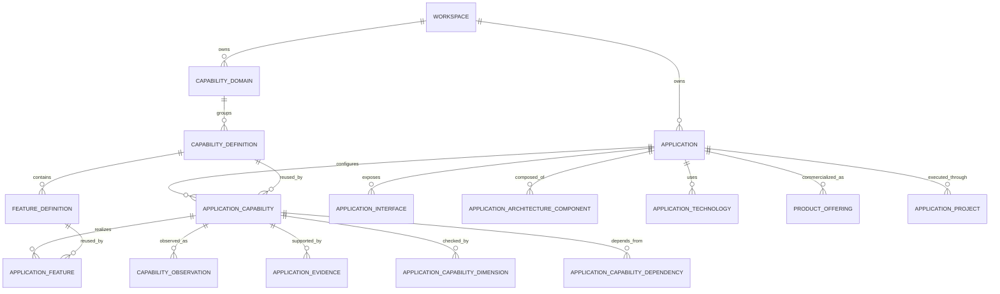

# Innovation, Product Engineering, and Productization

## Status

Approved and implemented foundation. This document is the canonical domain
contract for defining applications in `11 Innovation`, productizing the same
records in `02 Products & Services`, and exposing evidence-backed application
context to humans and supervised agents.

## Purpose

Roost is the source of truth for what an application should be, what has
actually been observed, why that observation is trusted, what remains missing,
and how the same application becomes a commercial product or service.

This domain is not a task manager. Projects, tasks, processes, pipelines, and
procedures remain shared execution mechanisms. Product Engineering defines the
desired and observed product model that can drive that execution.

## Ownership boundaries

- `Application` is the durable identity of a software application.
- `Project` is a reusable execution container and may be linked to an
  application through `ApplicationProject`.
- `ProductOffering` represents a sellable product, service, or hybrid offering
  and may reference an application.
- Innovation and Products & Services read the same application record. Moving
  into productization never copies or hides the application.
- Roost stores knowledge about Soar's trading capabilities; it does not
  implement Soar's trading behavior.
- API authorization capabilities, adapter `IntegrationCapability` records,
  and product `CapabilityDefinition` records are separate namespaces.

## Domain model



Global definition, application configuration, target state, observed state,
and evidence are intentionally separate:

```text
CapabilityDefinition(Authentication)
  -> ApplicationCapability(Roost, REQUIRED, target COMPLETE)
  -> CapabilityObservation(PARTIAL, observedAt, source, actor)
  -> ApplicationEvidence(test/path/API, verification status)
```

Evidence verification does not automatically change observed state. A new
observation is an explicit command with its own actor, timestamp, source, and
summary.

## Lifecycle

Application identity carries two related lifecycle fields:

- innovation: idea, discovery, prototype, MVP, development, validation,
  productization, productized, archived;
- product: not productized, candidate, launch preparation, active, growth,
  mature, maintenance, deprecated, retired.

An application can therefore be `innovation=productized` and
`product=active` while retaining its complete development history.

## Capabilities and features

Functional hierarchy is bounded to:

```text
Domain -> Capability -> Feature
```

`CapabilityDefinition` and `FeatureDefinition` are reusable definitions.
`ApplicationCapability` and `ApplicationFeature` contain application-specific
applicability, priority, target, observation, lifecycle, and notes.

Applicability is one of `required`, `recommended`, `optional`, or
`not_applicable`. `not_applicable` is excluded from readiness and gaps.

Definition of Done dimensions are explicit child records on an application
capability. They support backend, frontend, API, database, tests,
documentation, monitoring, security, UX, mobile, MCP, or future workspace
specific checks without adding columns to the capability table.

## Packs and blueprints

- A `CapabilityPack` aggregates existing definitions and never creates copies.
- An `ApplicationBlueprint` defines an editable baseline of capability
  applicability and priority.
- Applying either structure upserts application-specific configurations while
  preserving the global definitions.

The seed includes Core SaaS, AI Ready, and a SaaS Web Application blueprint.
The catalog remains editable without code migrations.

## Architecture, technologies, and interfaces

Architecture is represented by typed components such as frontend, backend,
database, cache, queue, storage, deployment, CI/CD, and external services.
Components may reference `TechnologyDefinition` records.

Application interfaces are typed as human UI, REST, GraphQL, WebSocket,
webhook, event, MCP resource, MCP tool, CLI, or SDK. They may link to a
capability or feature and record approval and audit requirements.

## Dependencies, gaps, and blockers

Application capability dependencies use foreign keys to both capabilities.
A required dependency whose observed state is below `complete` blocks the
dependent capability. Gap queries derive target minus observed state and group
results by blocker, critical, high, and medium severity.

No automatic scheduler or task generator is part of this domain. Gaps may
later be linked to shared projects, tasks, workflows, and procedures.

## Readiness calculation

Readiness algorithm `product-readiness-v1` is deterministic and returned with
its explanatory components:

```text
60% observed capability state
+ 25% Definition of Done dimension state
+ 15% verified evidence coverage
```

Applicability weights are required `1.0`, recommended `0.6`, optional `0.25`,
and not applicable `0`. State scores are unknown/not started/missing `0`,
partial `0.5`, complete `0.9`, and verified `1.0`.

Each capability is grouped under an editable readiness dimension. Overall
readiness is the weighted average of dimension scores. The response exposes
the formula, input counts, component scores, and blockers; it is not generated
by an LLM and is not a manually entered decoration.

## Evidence and documentation import

Evidence types include source files, commits, pull requests, tests, API
endpoints, screenshots, deployments, documentation, database objects, metrics,
external URLs, and manual verification. Provenance distinguishes human, agent,
system, import, and repository scan sources.

Seeded application records register the documentation roots for Roost, Soar,
and Featherly as unverified documentation evidence. Nest and Aviary are
registered with `documentationImport=source_missing` until source documents
exist. A documentation root proves provenance only; it does not prove runtime
implementation.

## API and agent context

The protected `/v1/product-engineering` API provides catalog and application
commands plus the following read models:

- `GET /portfolio`
- `GET /graph`
- `GET /applications/:id/graph`
- `GET /applications/:id/capability-map`
- `GET /applications/:id/gaps`
- `GET /applications/:id/readiness`
- `GET /applications/:id/agent-context`

The agent context packet contains application identity, both lifecycle states,
target and observed capabilities, gaps, blockers, dependencies, architecture,
technologies, interfaces, evidence coverage, and readiness. It explicitly
states that declarations are not observations and evidence does not silently
promote state.

## Application Graph

`11 Innovation / Application Graph` is an interactive read projection of the
same Product Engineering records. It does not own application, capability,
feature, evidence, dependency, readiness, or lifecycle state and introduces no
parallel graph tables.

The bounded product and implementation hierarchy is:

```text
Company -> Application -> Graph Domain -> Capability -> Feature
                                                -> Implementation Layer -> Implementation Atom
                    -> Operating model -> Application Procedure -> Procedure Step
                    -> Delivery -> Project -> Task List -> Task
Capability -> Reusable Procedure -> Procedure Step
```

An implementation atom is an existing `ApplicationArchitectureComponent` with
structured provenance metadata. It may represent a page, component, API route,
service, database model, test, document, workflow, agent, or executable chain.
The graph does not introduce a parallel source-of-truth table. Registry source
IDs, parent IDs, verification state, code paths, risk, completion, and typed
relations are retained in component metadata and projected by
`application-graph-v2`.

Execution state remains shared with the rest of Roost. `ApplicationProcedure`
links application-specific lifecycle and release procedures, while
`CapabilityProcedure` links a reusable procedure to a capability definition so
every assigned application inherits the same operating skeleton. Projects are
linked through `ApplicationProject`; their existing task lists and tasks are
projected directly. The application cockpit's Execution workbench manages these
links, and `application-agent-context-v2` exposes the same operating model to AI
agents. No procedure, project, list, or task is copied into Product Engineering.

Graph domains are deterministic navigation groups over canonical
`CapabilityDomain` records. The `application-graph-domains-v1` mapping keeps a
comparable structure across applications: Experience projects to Frontend,
Identity & Access to Backend, Interfaces to API / Integrations, AI / Agent
Readiness to AI / MCP / Agents, and product-specific Trading or Company
Operating System capabilities to Domain. Unrecognized catalog domains remain
visible under their canonical name. The mapping never copies or reassigns the
source capability definition.

`GET /graph` returns only the company and application portfolio required for
the initial canvas. `GET /applications/:id/graph` lazily returns one complete
application projection with domains, capabilities, assigned features,
implementation layers and atoms, hierarchy edges, typed implementation
relations, blockers, evidence summaries, ancestor paths, and deterministic
completeness derived from Product Engineering state.

The web client uses a bounded 2.5D constellation rather than literal WebGL
3D. The focused node remains central, direct children form an orbit or readable
grid, and the complete ancestor path remains visible as a compact canvas spine
as well as in the breadcrumb. Optional depth two reveals one additional ring.
Dependency mode adds only the focused node's bounded relation neighbourhood.
This preserves spatial context and readable text without occlusion, camera
navigation, or a whole-portfolio hairball. The client may load all application
projections only after a cross-portfolio search is requested.

`npm run seed:soar-graph -- <path-to-soar>` is an explicit local/import command
for the Soar architecture registry. It converts Soar feature records to native
Roost feature assignments and imports non-feature registry records and chains
as architecture atoms. It is idempotent for records whose metadata source is
`soar-architecture-registry`; it is not part of the production seed and does
not infer verified runtime state beyond the source registry's declarations.

The supported visual modes are Structure, Execution, Progress, Dependencies,
Agent Ready, and Productization. They are alternate interpretations of one packet, not
stored state. Required incomplete dependencies are represented as blocker
edges. Missing evidence and incomplete required state remain explicit and are
never inferred as complete by the graph.

## Shared procedure management

Operations exposes the shared Process Core procedure workbench. Procedures are
versioned definitions:

- create always produces a draft;
- editing a draft updates that draft;
- improving an active procedure creates a new draft version in the same
  family;
- activation retires the previous active family version;
- archive and activation are explicit audited lifecycle commands.

Humans and agents may propose improvements. Agents cannot activate an improved
procedure merely by submitting a patch.

## UI surfaces

- `11 Innovation`: portfolio, Application Graph, calculated readiness, editable application
  profile, application cockpit, capability matrix and detail, gaps,
  architecture, interfaces, evidence, capability library, packs, and
  blueprints.
- `02 Products & Services`: offerings linked to the same applications,
  commercial lifecycle, sales/support readiness, and application
  productization blockers.
- `04 Operations / Procedures`: reusable procedure definitions, versions,
  draft editing, activation, archive, and AI improvement contract.

## Deferred extensions

- content-aware repository/document import and reconciliation;
- first-class feature assignment UI;
- history timeline projection across audit/event/observation records;
- richer pricing, legal, release, customer onboarding, and support models;
- MCP resources and curated high-level tools above the HTTP route manifest;
- automated repository scanning, which must remain evidence-producing rather
  than an autonomous source of truth.
