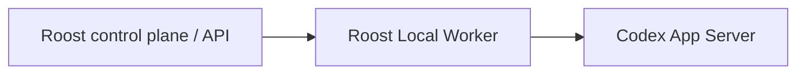

# ADR-001: Direct Codex App Server pilot execution

Date: 2026-09-13
Status: accepted
Owner: Roost architecture owner
Decision version: 1
Scope: RF-HERMES-004; architecture and documentation only

## Context

The previous pilot direction required Hermes between Local Worker and Codex.
[RF-HERMES-001](../architecture/hermes-codex-isolation-assessment.md) distinguished
Hermes model-provider use from its optional Codex App Server runtime.
[RF-HERMES-002](../operations/hermes-linux-synthetic-transport.md) verified a
private installation and 29 independent fake-server boundary cases, but Hermes
session import attempted filesystem mutation before a session could start.
[RF-HERMES-003](../architecture/hermes-clean-transport-api.md) found no complete
clean public transport API in the pinned official release: connection/session
imports initialize configuration and discovery, and required Worker controls
are not fully propagated. These are dated findings about that pin.

The explicitly authorized RF-HERMES-004 architecture decision accepts option C
below. It does not reinterpret a blocked experiment as runtime qualification.

## Decision

The pilot execution target is **Roost control plane/API → Roost Local Worker →
directly Codex App Server**. Hermes is not required in this execution path at
the current stage.



Apply adopt-before-build by adopting the official Codex App Server protocol.
Specify a thin Worker adapter for Roost's existing contracts and missing
enforcement; do not invent a replacement protocol, fork or copy upstream source,
or introduce a second task/state engine. Upstream protocol support alone does
not prove effective policy, budget or containment enforcement.

| Component | Responsibility and boundary |
| --- | --- |
| Roost control plane/API | Canonical goals, tasks, hierarchy, context, authority, Decisions, admission and audit. Only its current grants and sealed execution packet authorize work. |
| Roost Local Worker | Lease, checkpoint/resume reconciliation, one writer, resource and child-process ownership; exact executable/environment/model/effort/policy/budget enforcement and complete stop. Reuse existing state and fencing mechanisms. |
| Codex App Server | One authorized turn and its permitted tools in a pinned environment, bounded by Worker. It cannot grant Roost authority or independently advance tasks. |
| Hermes, optional later | Orchestration or UX proposals through a separately admitted contract. Outside enforcement of authority, policy, budget, admission and stop; no direct launch, autonomous continuation or bypass of Worker/API gates. |
| OpenShell, optional | A separately evaluated isolation mechanism. It is not a Hermes–Codex adapter or a mandatory current dependency. Required isolation guarantees remain mandatory regardless of mechanism. |

### Architecture target versus implemented runtime

This is decision version 1, **not a provider registry version bump**. The
[implemented registry](../../src/modules/agent-runtime/execution-providers.json)
and [provider contract v5](../architecture/adopt-before-build.md) retain their
existing configuration, diagnostics, pins, policies and admission denials.
The registry still describes the previous intended Hermes integration. This
document supersedes that architectural prerequisite; it does not reconcile
executable registry semantics or authorize a provider substitution.

The existing `direct_codex` CLI reference is not the new direct App Server
adapter. The RF-HERMES-002 synthetic wrapper is not an approved production
implementation. Its fake-server results and the historical single CLI proof
do not establish real App Server compatibility, supported-host containment,
hard output-token/cost limits or pilot readiness.

All activation guards remain:

```text
executionSupported=false
pilotReady=false
liveAdmissionAllowed=false
```

Execution stays disabled, observer stays observe, Hermes stays disabled and
`pilotReadiness.ready` stays false. No host metadata, local ready switch,
environment flag, successful import or architecture decision grants execution.
Existing API and Worker checks still deny admission independently, including
host lifecycle isolation and hard output-budget gates. OpenShell's optional
status does not waive isolation from Docker/WSL host control.

Preserve exact input/context seals, current Ready/risk/Decisions, lease and
single-writer fences, redaction, model/effort, policy, duration/output/cost
budgets, callback authority, context invalidation, checkpoint reconciliation
and descendant cleanup. No automatic fallback, retries outside the admitted
budget, replay of consumed input or resumed work under stale authority is allowed.

### Measurable conditions for reconsidering Hermes

Hermes remains optional. Reconsideration requires a separately authorized,
versioned contract and independent admission review. Every applicable row must
have reproducible evidence; an unknown or unproven mandatory field fails closed.
Passing these conditions is necessary, not automatic authorization to activate
Hermes or place it in the execution path.

| Condition | Required evidence and failure criterion |
| --- | --- |
| Exact supported candidate | Pin official source/commit, dependency and toolchain identities, installed inventory and executable SHA-256. Missing, changed or extra executable/dependency artifacts fail before launch. |
| Clean import and initialization | In fresh processes with empty and populated synthetic homes and a poisoned ambient environment, public import and initialization cause zero undeclared filesystem mutations, authentication/config discovery, network operations or child launches. No hidden migration, plugin/MCP discovery or background action is permitted. |
| Complete sealed controls | Verify executable/hash, exact argv, replacement environment, actual process cwd, sandbox, approval policy, model, reasoning effort, ephemeral mode and callback routing at the boundary and effective protocol/configuration state before the first turn. A negative case for each missing or changed field must deny launch or turn admission. A declaration or overlay environment is insufficient. |
| Hermetic configuration | Only sealed allowlisted roots and variables are consumed; no inherited provider credentials, fallback HOME/config, ambient environment expansion or reads outside admitted roots. Poisoned config/env and unexpected discovery must fail closed without exposing values in receipts. |
| Controlled callbacks and auxiliary behavior | Exact callback allowlist, attempt/thread/context binding, serial and lifetime bounds, and Worker-owned decisions. Unknown requests, revoked authority, extra providers, auxiliary model calls, migration, memory review or automatic continuation are denied; no callback can expand scope. |
| Enforced resources and accounting | Demonstrate finite admitted startup/turn/total deadlines, raw per-record/aggregate byte bounds, and effective execution-wide token/cost caps including auxiliary activity and retries. Missing usage cannot become zero or an assumed success. A budget breach stops the attempt. |
| Whole-process stop and recovery | Exercise cancel, timeout, context change, lease loss, crash and restart. All owned descendants stop within the admitted stop deadline (at most five seconds); no surviving child, foreign-process signal, late terminal acceptance or consumed-input replay. Record supported-platform containment limits explicitly. |
| Negative matrix and independent verification | Include field/config drift, malformed/oversized/unknown protocol events, callback floods, stale authority, incomplete/duplicate terminal events, exhausted budgets and cleanup failures. All deny cases must pass under independent reproduction against the same pinned artifacts. Fake transport proof cannot substitute for separately authorized real-server and OS containment evidence. |
| Explicit readmission | An independent reviewer resolves every mandatory finding and records evidence/limits. A separate accepted architecture/contract decision and explicit activation authority must precede any integration or live admission. |

## Alternatives Considered

| Option | Pros | Cons | Disposition and reason |
| --- | --- | --- | --- |
| A. Supported clean Hermes library API | Could reuse upstream connection/session behavior. | Pinned public connection/session imports have side effects; clean helpers do not supply a complete connection or sealed Worker controls. | Rejected for the current pin. Reconsider only against the conditions above. |
| B. Separate Hermes CLI/process with isolated configuration | A process boundary could separate dependencies and UX. | Isolated HOME changes the mutation destination; shipped CLI/agent/ACP paths retain discovery and auxiliary behavior without a complete sealed App Server contract. More lifecycle and authority boundaries require proof. | Deferred; not a current pilot prerequisite or qualified bridge. |
| C. Direct Codex App Server through Local Worker | Uses the official protocol and keeps Roost enforcement at its existing Worker boundary; removes the unqualified mandatory intermediary. | Requires a specified adapter and subsequent compatibility, budget, callback, lifecycle and OS containment evidence. | Accepted architecture target. Implementation and activation remain blocked. |

## Consequences

- Positive: pilot progress no longer depends on finding a clean Hermes transport
  API; authority and stop remain owned by existing Roost mechanisms.
- Negative: the direct adapter is still missing and must satisfy every retained
  enforcement gate. This decision supplies no runtime readiness evidence.
- Compatibility: the unchanged v5 registry may still report Hermes installation
  or compatibility blockers. These are legacy diagnostic semantics, not a reason
  to install Hermes as a prerequisite for specifying the new target. Future
  reconciliation must be versioned and preserve independent fail-closed admission.
- Operational scope: no runtime/code/dependency/configuration/database changes,
  installation, Worker/Hermes/Codex/model/OpenShell execution, network access,
  publication, push or deployment are authorized by this documentation change.
  Docker/WSL lifecycle and existing workloads must remain unchanged.

## Evidence

- [RF-HERMES-001 static isolation assessment](../architecture/hermes-codex-isolation-assessment.md).
- [RF-HERMES-002 bounded synthetic transport and limits](../operations/hermes-linux-synthetic-transport.md).
- [RF-HERMES-003 public API assessment and A/B/C comparison](../architecture/hermes-clean-transport-api.md).
- [Worker input, authority and provider contract](../architecture/adopt-before-build.md).
- [Implemented supervised runtime and stop/recovery](../architecture/local-codex-agent-runtime.md).
- [Activation contract](../architecture/autonomy-activation-contract.md) and
  [requirements traceability](../architecture/traceability-matrix.md).

## Follow-up work

Exactly one next atomic task: **RF-HERMES-005 — specify the direct Local Worker–
Codex App Server adapter contract and testable acceptance criteria, without
implementation.** Define mapping to the official protocol, sealed inputs and
effective control verification, lifecycle/callback/resource/stop boundaries,
negative cases, evidence requirements and versioned reconciliation of the v5
registry. Keep all three activation guards false. No code, dependency changes,
installation, live calls or activation belong to that specification task.

## Supersession

This accepted decision supersedes only the mandatory-Hermes pilot prerequisite
in earlier architecture descriptions and resolves RF-HERMES-003's pending
architecture recommendation. RF-HERMES-001..003 remain dated evidence, including
their original verdicts and proof limits; their sealed receipts are not rewritten.
Security, budget, authority and activation requirements remain in force.
There is no superseding decision at version 1.
